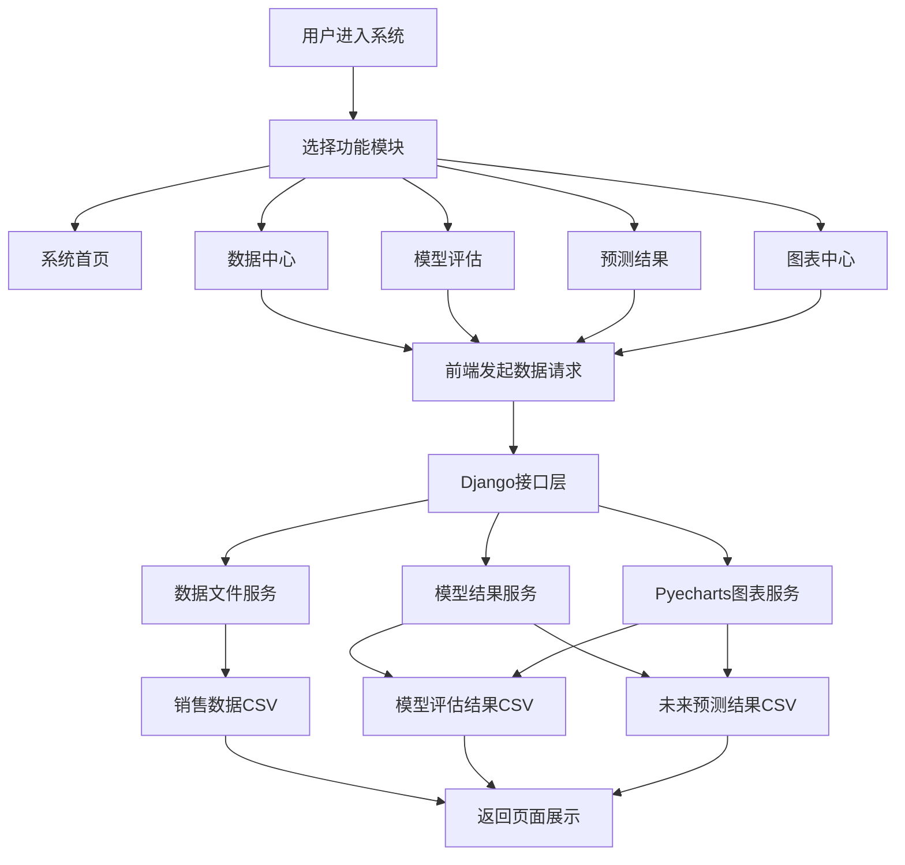
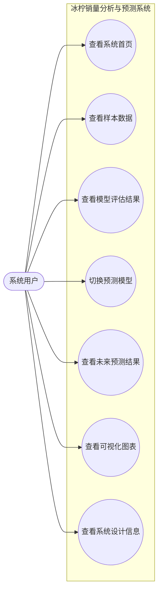
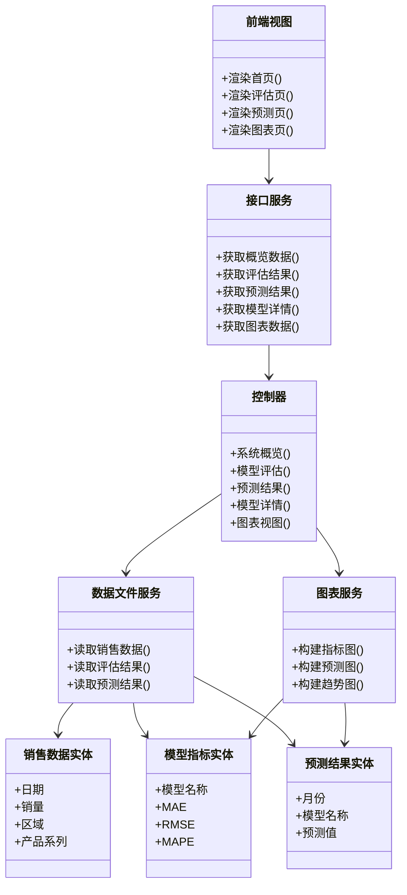
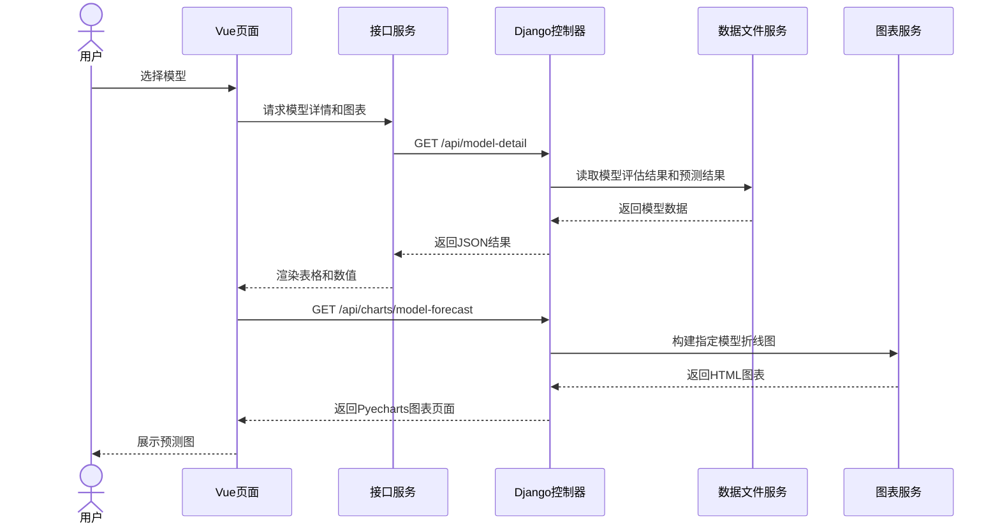
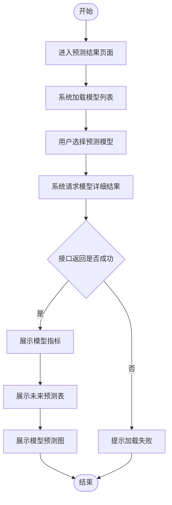
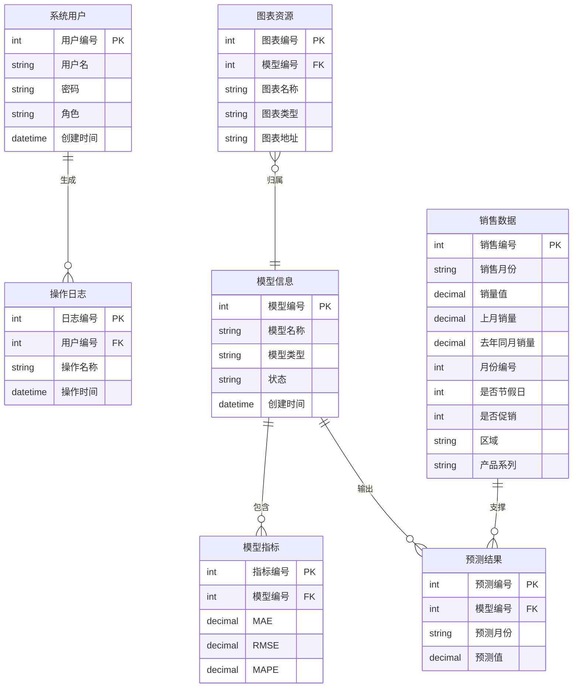

# 系统建模 Mermaid 代码

下面这些 Mermaid 代码可以直接用于生成论文中的业务流程图、用例图、类图、顺序图、活动图和 ER 图。

## 1. 业务流程图

```mermaid
flowchart TD
    A[用户进入系统] --> B[选择功能模块]
    B --> C[系统首页]
    B --> D[数据中心]
    B --> E[模型评估]
    B --> F[预测结果]
    B --> G[图表中心]

    D --> H[前端发起数据请求]
    E --> H
    F --> H
    G --> H

    H --> I[Django接口层]
    I --> J[数据文件服务]
    I --> K[模型结果服务]
    I --> L[Pyecharts图表服务]

    J --> M[销售数据CSV]
    K --> N[模型评估结果CSV]
    K --> O[未来预测结果CSV]
    L --> N
    L --> O

    M --> P[返回页面展示]
    N --> P
    O --> P
```

## 2. 系统用例图

```mermaid
flowchart LR
    User([系统用户])

    subgraph System[冰柠销量分析与预测系统]
        UC1((查看系统首页))
        UC2((查看样本数据))
        UC3((查看模型评估结果))
        UC4((切换预测模型))
        UC5((查看未来预测结果))
        UC6((查看可视化图表))
        UC7((查看系统设计信息))
    end

    User --> UC1
    User --> UC2
    User --> UC3
    User --> UC4
    User --> UC5
    User --> UC6
    User --> UC7
```

## 3. 系统类图

```mermaid
classDiagram
    class FrontendView["前端视图"] {
        +渲染首页()
        +渲染评估页()
        +渲染预测页()
        +渲染图表页()
    }

    class ApiService["接口服务"] {
        +获取概览数据()
        +获取评估结果()
        +获取预测结果()
        +获取模型详情()
        +获取图表数据()
    }

    class DashboardController["控制器"] {
        +系统概览()
        +模型评估()
        +预测结果()
        +模型详情()
        +图表视图()
    }

    class CsvDataService["数据文件服务"] {
        +读取销售数据()
        +读取评估结果()
        +读取预测结果()
    }

    class ChartService["图表服务"] {
        +构建指标图()
        +构建预测图()
        +构建趋势图()
    }

    class SalesDataRecord["销售数据实体"] {
        +日期
        +销量
        +区域
        +产品系列
    }

    class ModelMetric["模型指标实体"] {
        +模型名称
        +MAE
        +RMSE
        +MAPE
    }

    class ForecastResult["预测结果实体"] {
        +月份
        +模型名称
        +预测值
    }

    FrontendView --> ApiService
    ApiService --> DashboardController
    DashboardController --> CsvDataService
    DashboardController --> ChartService
    CsvDataService --> SalesDataRecord
    CsvDataService --> ModelMetric
    CsvDataService --> ForecastResult
    ChartService --> ModelMetric
    ChartService --> ForecastResult
```

## 4. 系统顺序图

### 场景：用户查看指定模型预测图

```mermaid
sequenceDiagram
    actor User as 用户
    participant Page as Vue页面
    participant API as 接口服务
    participant Controller as Django控制器
    participant DataService as 数据文件服务
    participant ChartService as 图表服务

    User->>Page: 选择模型
    Page->>API: 请求模型详情和图表
    API->>Controller: GET /api/model-detail
    Controller->>DataService: 读取模型评估结果和预测结果
    DataService-->>Controller: 返回模型数据
    Controller-->>API: 返回JSON结果
    API-->>Page: 渲染表格和数值

    Page->>Controller: GET /api/charts/model-forecast
    Controller->>ChartService: 构建指定模型折线图
    ChartService-->>Controller: 返回HTML图表
    Controller-->>Page: 返回Pyecharts图表页面
    Page-->>User: 展示预测图
```

## 5. 系统活动图

### 场景：模型预测结果查看活动图

```mermaid
flowchart TD
    A([开始]) --> B[进入预测结果页面]
    B --> C[系统加载模型列表]
    C --> D[用户选择预测模型]
    D --> E[系统请求模型详细结果]
    E --> F{接口返回是否成功}
    F -- 是 --> G[展示模型指标]
    G --> H[展示未来预测表]
    H --> I[展示模型预测图]
    I --> J([结束])
    F -- 否 --> K[提示加载失败]
    K --> J
```

## 6. ER 图

```mermaid
erDiagram
    系统用户 ||--o{ 操作日志 : 生成
    模型信息 ||--o{ 模型指标 : 包含
    模型信息 ||--o{ 预测结果 : 输出
    销售数据 ||--o{ 预测结果 : 支撑
    图表资源 }o--|| 模型信息 : 归属

    系统用户 {
        int 用户编号 PK
        string 用户名
        string 密码
        string 角色
        datetime 创建时间
    }

    销售数据 {
        int 销售编号 PK
        string 销售月份
        decimal 销量值
        decimal 上月销量
        decimal 去年同月销量
        int 月份编号
        int 是否节假日
        int 是否促销
        string 区域
        string 产品系列
    }

    模型信息 {
        int 模型编号 PK
        string 模型名称
        string 模型类型
        string 状态
        datetime 创建时间
    }

    模型指标 {
        int 指标编号 PK
        int 模型编号 FK
        decimal MAE
        decimal RMSE
        decimal MAPE
    }

    预测结果 {
        int 预测编号 PK
        int 模型编号 FK
        string 预测月份
        decimal 预测值
    }

    图表资源 {
        int 图表编号 PK
        int 模型编号 FK
        string 图表名称
        string 图表类型
        string 图表地址
    }

    操作日志 {
        int 日志编号 PK
        int 用户编号 FK
        string 操作名称
        datetime 操作时间
    }
```
